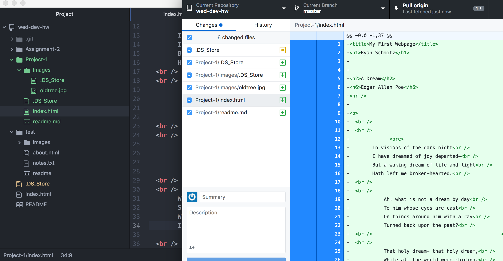

## Technical Report

###### Browsers I Have Used
1.) Netscape

2.) Internet Explorer

3.) Firefox

4.) Chrome

Netscape, released 23 years ago, was one of the first browsers I used. I don't remember much about it, but judging based on the screenshots I have found, it is severely dated now. I used Internet Explorer and Firefox interchangeably, but I had a preference for Firefox. The longest-running browser that I have used is Chrome, it gets the job done.

The Wayback Machine is such an awesome resource. I was able to re-live some of my oldest memories on the internet with sites like Youtube and Myspace. I also went to the University of Montana's webpage during it's initial launch. The website was very different in 1997, it has grown so much.

This assignment was fairly straight-forward for me. It looks like I am starting to get the hang of this thing! I really appreciate the tutorial that comes before each assignment, I know I would be in the dark without it. It was also nice starting with Markdown, then working my way into HTML. I was more prepared having the previous experience.

