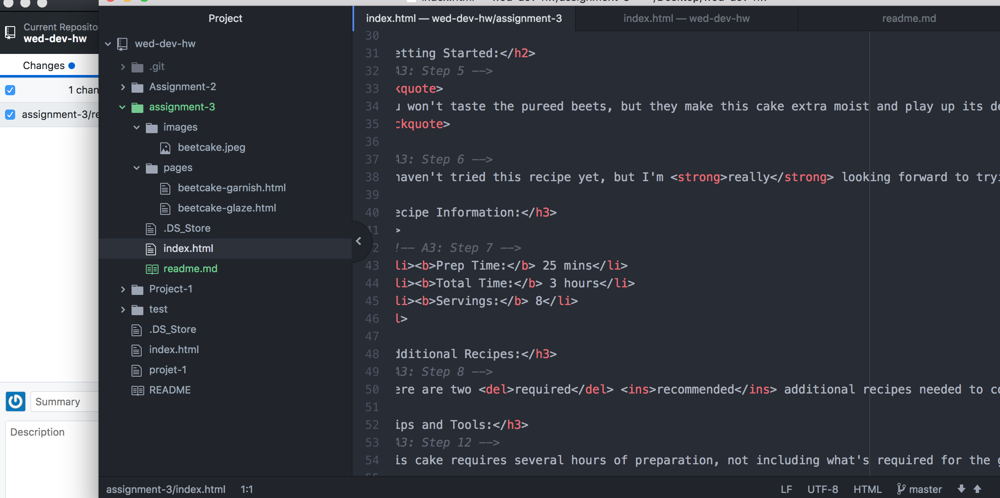

# Technical Report
In a webpage, there can only be one head and and body element. The head element contains necessary pieces for processing information. The body contains the bulk of the visual information that a viewer of your page will see. This will often include either:

* Structural Markup: This contains structural information about the page such as headings and paragraphs.
* Semantic Markup: This uses elements such as italics or bold words.

This week went quite well. I gave myself much more time to complete the assignment compared to the previous weeks'. I can see the work getting more and more challenging, but as long as I allow myself some time, I should be solid.

