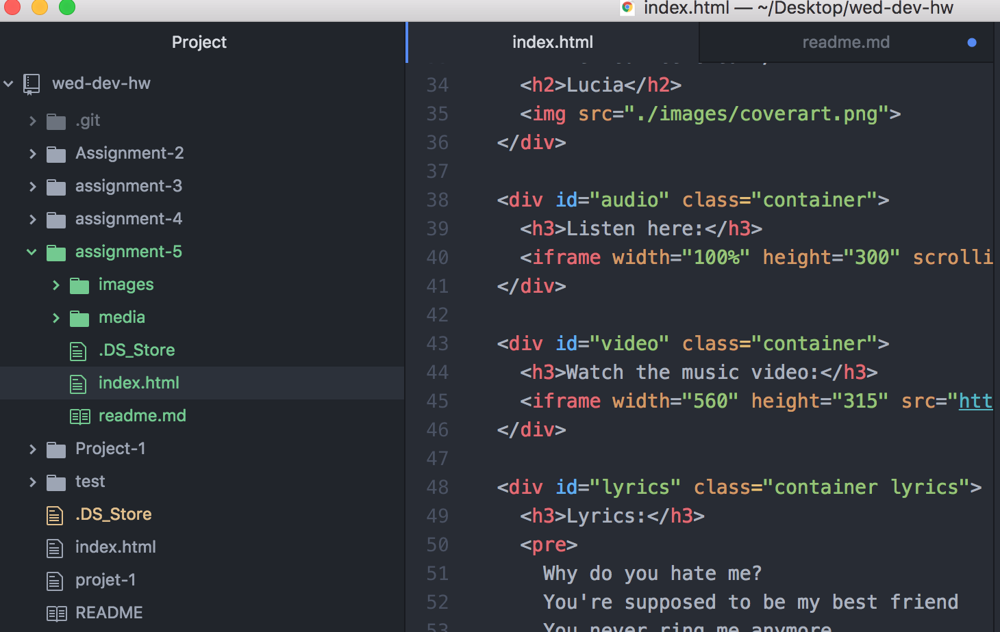

## Technical Report

The div element allows web developers to assign a block-level element to combine elements together. Classes are an identification system that allows developers to add an identifier and selector value to elements. The ID elements attributes a unique identifier to elements where its value is a string. The span element works within div, but allows us to identify/group content together for organizational purposes, as well as to add extra styling.

Self-hosting media causes many issues to arise. There is a huge cost when it comes to the space required to host media. Third-party hosting platforms offer a relatively cheap alternative to an otherwise expensive endeavor.

This week's work was much better than the last. I breezed through this assignment. It still took some time of course, but I was able to solve issues with very few hiccups.

