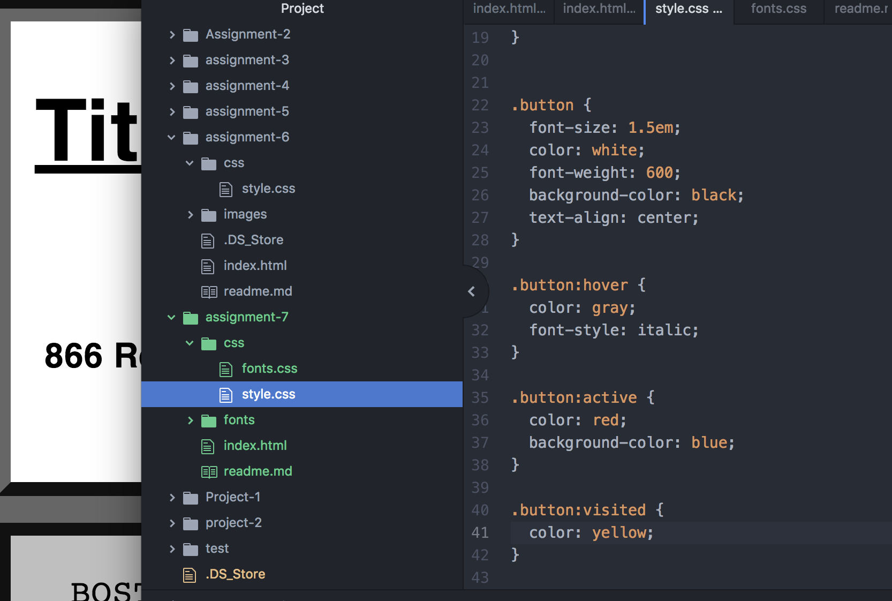

# Technical Report

I chose the New York Times article because I wanted to experiment with a news-based website. I think fonts are immensely powerful when designing and creating a feeling. I'm not sure I totally nailed it, but I went with the fonts that I feel reflect print the most. I chose a sans-serif title (Anton) with a serif body (Crimson Text).

### A system font is used by an operating system for things like buttons, menus, etc.
### A web font is a font used for websites using CSS.
### A web-safe font is a font that is pre-installed by an operating system. (CSSFontStack)

This week was fairly simple. I feel like I am still struggling with CSS a bit because there are many ways you can go about completing something, and if one thing is wrong, nothing will appear. Other than that, I have been handling it well.

