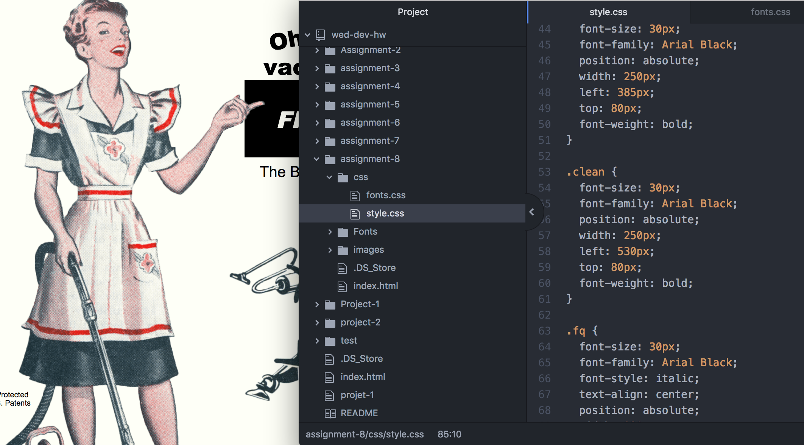

## Technical Report
A margin is the space outside a border,
padding is the space between the border
and the content, and the border is
the edge that contains the content.

The most challenging part of this assignment
was the placement of everything. Making everything
align correctly was easily the most time-
consuming part. I would say the fonts were also
challenging, but I chose to use web safe fonts to
save time.

I know that I didn't get exactly the right outcome,
but I feel like the point wasn't to completely
mimic the original, but instead to learn more
about CSS.

