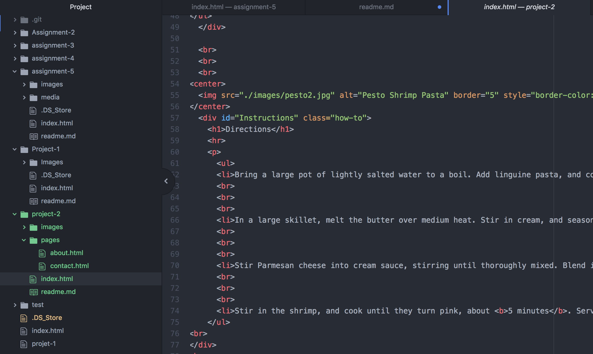

## Technical Report
This week was a bit challenging because there was really nothing to base our website on. I had to use the tools that I have learned over the course of the semester, and I'd be lying if I didn't say it was challenging at times.

I am happy with the final result, but there is still much to learn. HTML overall was fairly straightforward, besides some minor hiccups, but I worked my way through them.

CSS sounds like a really cool tool and I am excited to bring my webpages to life with it. I want to experiment with effects such as dissolves and animation techniques.

